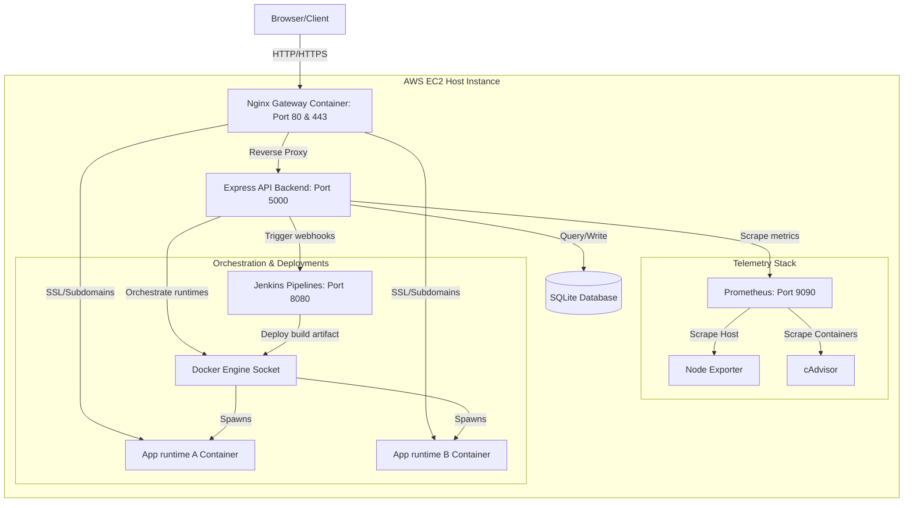

# DeploySphere System Architecture

This document describes the technical architecture, dynamic routing, and telemetry pipeline of the DeploySphere PaaS.

---

## 1. System Architecture Diagram

The diagram below maps how external clients, Nginx gateways, backend APIs, Docker socket runtime engines, Prometheus monitors, and Jenkins CD runtimes interact:

---

## 2. Component Design Specifications

### Nginx Dynamic Proxy Gateway
- Listens on ports `80` (HTTP) and `443` (HTTPS).
- Uses virtual server block maps in `/etc/nginx/conf.d/deploysphere-*.conf`.
- Hot-reloaded dynamically by the Express API executing `docker exec deploysphere-nginx nginx -s reload` upon deployment compile outcomes or custom domain assignments.

### Telemetry Pipeline
- **cAdvisor**: Collects container-level CPU, memory, network interfaces, and disk I/O metrics.
- **Node Exporter**: Collects host CPU cores, memory loads, disk capacity, and uptime.
- **Prometheus**: Aggregates metric timeseries databases. Exposes JSON scrape targets queried by the backend Express telemetry service.

### SSL Certs Handler
- Executes Certbot automated ACME HTTP-01 challenge validations.
- Automatically falls back to generating a 2048-bit self-signed OpenSSL key/certificate block for local sandbox testing if validation fails.
- Renders real-time command terminal build output logs to client consoles.

### Database Layer
- **SQLite** (Default local sandbox): Handled via Prisma Client with full cascading deletes mapping users, projects, and deployments.
- **PostgreSQL** (AWS Production): Multi-container Compose integration.
